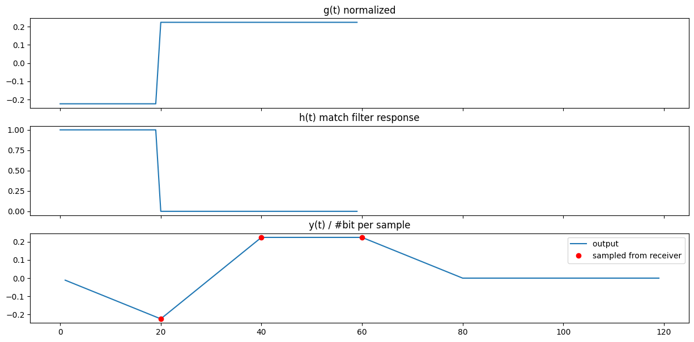

# Assignment 2 [DC]

**Name:** علياء عبدالعزيز على عبدالله

**Section:** 1

**Bench Number:** 26

# Part 1

## ✍️ Hand Analysis

### Math

-1.png)

### Blocks

-2.png)

## 🤖 Simulation output



## 😎 Code

### Constants

```python
import numpy as np  
import matplotlib.pyplot as plt
from scipy.signal import convolve, fftconvolve
from scipy.special import erfc
```

```python

num_bits = 100              # number of bits will send
num_samples_per_bit = 20    # number of sample to convert it to continouse
Ts = 1                      # discrete sampling time
A = 1                       # amplitude of signal
g1_t = A * np.ones(num_samples_per_bit) # pulse shape when "1" was sent
g1_t_norm = np.linalg.norm(g1_t, axis=0) # for normalizaton 1/sqrt(num_sample_per_bits)
print(g1_t_norm) #4.47213595499958
```

### Functions

```python
def generate_bipolar_NRT_sig(data: np.ndarray, num_samples_per_bit = num_samples_per_bit):
    """
    parameters:
        data: binary array of shape num_bits
    return:
        time: numpy array represent time axis
        g_t : output signal from transmitter
    """
    g_t = np.repeat(data, num_samples_per_bit) # repeat every data point "num_samples_per_bit" [010] => [0000111110000]
    g_t = ((g_t * 2) - 1) # convert 0 -> -A | 1 -> A
    return g_t / g1_t_norm

def generate_match_filter(g1_t: np.ndarray, num_bits = num_bits, num_samples_per_bit = num_samples_per_bit):
    # g1_t : impulse shape when sending "1" must be in shape (num_samples_per_bit, )
    h_t = g1_t[::-1] # just reverse it
    h_t = np.concatenate([h_t, np.zeros((num_bits - 1) * num_samples_per_bit)]) # adding zeros till match shape of g_t
    return h_t
```

### Simulation

```python
data = np.array([0, 1, 1])
g_t = generate_bipolar_NRT_sig(data) 
h_t = generate_match_filter(np.ones(num_samples_per_bit) * A, 3)
y_t = convolve(g_t, h_t) # ignoring noise return the same shape of g(t)
```

### Plotting

```python
fig, axs = plt.subplots(3, 1, figsize=(15, 7), sharex=True)
clock = (np.arange(3) + 1) * num_samples_per_bit # for sampling

axs[0].set_title("g(t) normalized")
axs[0].plot(g_t)

axs[1].set_title("h(t) match filter response")
axs[1].plot(h_t)

axs[2].set_title("y(t) / #bit per sample")
axs[2].plot(np.arange(1, len(y_t)+1), y_t / num_samples_per_bit, label = "output " ) # convolution shifted at boundries 
axs[2].plot(clock, y_t[clock-1] / num_samples_per_bit, "ro", label = "sampled from receiver")

plt.legend()
plt.show()
```

# Part 2

## ✍️ Hand Analysis

-3.png)

-4.png)

-5.png)

## Final Answer (written in latex ❤️)

$$

\text{ Matched Filter }\\ 
P(\text{error}) = 0.5 * \text{erfc}(A \sqrt{\frac{T}{N_o}}) = 0.5 * \text{erfc}(\sqrt{\frac{E}{N_o}}) \\
E = A^2 * T \\
\\
\\
\text{ No Filter }\\ 
P(\text{error}) = 0.5 * \text{erfc}(\frac{A}{\sqrt{N_o}}) = 0.5 * \text{erfc}(\frac{E}{\sqrt{N_o}}) \\
E = A \\
\\
\text{ Ramp Filter }\\ 
P(\text{error}) = 0.5 * \text{erfc}(\frac{\sqrt{3}A}{2}. \sqrt{\frac{T}{N_o}}) = 0.5 * \text{erfc}(\frac{E}{\sqrt{T N_o}}) \\
E = \frac{\sqrt{3}}{2}.A.T

$$

## 🤖 Simulation

### output from filters + comment


x-axis ⇒  Time * samples per bit

without any needed calculation for BER it’s obvious Matched Filter work the best and no Filter (pulse) work worse 

### BER (Simulation / Comment on problem 😢)

I know I kind of missed up with theoretical calculation due to upscaling I tried to look on energy on how it change the equation during upscaling (still don’t what I mess)

the theoretical distribution $\approx$ the simulated but shifted 


## Comments on Q5, Q6

### Q5) Is the BER an increasing or a decreasing function of 𝑬/𝑵𝒐? Why?

answer simply ⇒ BER is **decreasing** function of  $E/N_o$

as we increase $E/N_o$ we increase transmitted signal energy related to noise energy 

if energy of noise close to transmitted signal energy ⇒ $E / N_o \approx 1$ ⇒  noise will destroy signal easy

if energy of noise smaller to transmitted signal energy  ⇒  signal won’t feal noise

### Q6) Which case has the lowest BER? Why?

answer simply ⇒ **Matched Filter**

as matched filter multiply high values in signal by high values in filter than in thresholding
step then you can easily detect it is high value same thing done in low values

but other filters don’t multiply signal values with suitable values. 

## 😎 Code

### Generation Functions

functions that generate different type of filters, AWGN

```python
def generate_match_filter(g1_t: np.ndarray, num_bits = num_bits, num_samples_per_bit = num_samples_per_bit):
    # g1_t : impulse shape when sending "1" must be in shape (num_samples_per_bit, )
    h_t = g1_t[::-1] # just reverse it
    h_t = np.concatenate([h_t, np.zeros((num_bits - 1) * num_samples_per_bit)]) # adding zeros till match shape of g_t
    return h_t

def generate_pulse_filter(num_bits = num_bits, num_samples_per_bit = num_samples_per_bit):
    h_t = np.zeros((num_bits * num_samples_per_bit)) # just reverse it
    h_t[0] = 1
    return h_t

def generate_filter_p3(num_bits = num_bits, num_samples_per_bit = num_samples_per_bit):
    h_t = np.arange(0, num_samples_per_bit, dtype=np.float64)
    h_t *= np.sqrt(3)
    h_t = np.concatenate([h_t, np.zeros((num_bits - 1) * num_samples_per_bit)]) 
    return h_t
 

def generate_AWGN(No: int, num_bits = num_bits, num_samples_per_bit = num_samples_per_bit):
    noise = np.random.normal(0, No/2, size=(num_bits * num_samples_per_bit,))
    return noise
```

### Functions (More done)

```python
# channel jop
def generate_random_signal(num_bits,  No = 2, num_samples_per_bit = num_samples_per_bit):
    data =  np.random.choice([0, 1], size=(num_bits), p=[1./2, 1./2])
    g_t = generate_bipolar_NRT_sig(data, num_samples_per_bit) 
    w_t = generate_AWGN(No, num_bits, num_samples_per_bit) 

    return data, g_t, w_t
    
# receiver jop
def get_reciver_ouput(r_t, filter_type = "match", num_samples_per_bit = num_samples_per_bit):
    
    h_t = None
    
    if filter_type == "match":
        h_t = generate_match_filter(g1_t, num_bits, num_samples_per_bit)
    elif filter_type == "pulse":
        h_t = generate_pulse_filter(num_bits, num_samples_per_bit)
    else:
        h_t = generate_filter_p3(num_bits, num_samples_per_bit)
        
    y_t = convolve(r_t, h_t) 
    
  
    return h_t, y_t
```

### Drawing output of each Matched Filter

1. **calculation of random signal and output** 

```python
data, g_t, w_t = generate_random_signal(num_bits, No = 2)
r_t = g_t + w_t
h_t_match, y_t_match = get_reciver_ouput(r_t, "match")
h_t_pulse, y_t_pulse = get_reciver_ouput(r_t, "pulse")
h_t_p3, y_t_p3 = get_reciver_ouput(r_t, "p3")
```

1. **sampling**

```python
clock = (np.arange(num_bits) + 1) * num_samples_per_bit 
y_t_match_sampled = y_t_match[clock-1]
y_t_pulse_sampled = y_t_pulse[clock-1]
y_t_p3_sampled = y_t_p3[clock-1]
```

1. **plotting**

```python
fig, axs = plt.subplots(4, 1, figsize=(15, 15), sharex=True)
show_bound = len(g_t) + 10

axs[0].set_title("input of receiver")
axs[0].plot(r_t, label="r(t) = g(t) + w(t)")
axs[0].plot(g_t, label="g(t) normalized")
axs[0].grid(True)
axs[0].legend()

axs[1].set_title("y(t) using matched filter")
axs[1].plot(np.arange(1, show_bound + 1), y_t_match[:show_bound]) # convolution shifted at boundries 
axs[1].plot(clock, y_t_match_sampled, "ro", markersize=4)
axs[1].grid(True)

axs[2].set_title("y(t) using pulse filter")
axs[2].plot(np.arange(1, show_bound + 1), y_t_pulse[:show_bound] ) # convolution shifted at boundries 
axs[2].plot(clock, y_t_pulse_sampled, "o", markersize=4)
axs[2].grid(True)

axs[3].set_title("y(t) using part 3 filter")
axs[3].plot(np.arange(1, show_bound + 1), y_t_p3[:show_bound]) # convolution shifted at boundries 
axs[3].plot(clock, y_t_p3_sampled, "o", markersize=4)
axs[3].grid(True)

plt.show()

```

### BER Calculation & Plotting

### Functions

```python
def calc_sim_BER(data, sampled_received):
    error_prob = np.sum(data != sampled_received)
    error_prob /= data.shape[0]
    return error_prob

def calc_theo_BER(A, No, T, filter_type="match"):
    if filter_type == "match":
        return 0.5 * erfc(  A * np.sqrt(T / No ) ) 
    elif filter_type == "pulse":
        return 0.5 * erfc(  A / np.sqrt(No )  )
    else:
        return 0.5 * erfc( (np.sqrt(3) / 2) * A * ( np.sqrt(T / No))  )
```

### Calculations

```python
num_bits = 10**5

BER_simulated_match = []
BER_theortical_match = []

BER_simulated_pulse = []
BER_theortical_pulse = []

BER_simulated_p3 = []
BER_theortical_p3 = []

E = 1

data =  np.random.choice([0, 1], size=(num_bits), p=[1./2, 1./2])
g_t = generate_bipolar_NRT_sig(data)
AA = 1 / g1_t_norm            # amplitude after upsampling normalization
TT = num_samples_per_bit      # sampling time after upsampling

for E_div_No_db in range(-10, 21): 
    E_div_No = 10 ** (E_div_No_db/10)
    No = E / E_div_No
    
    w_t = generate_AWGN(No, num_bits, num_samples_per_bit) 
    r_t = g_t + w_t 
    
    h_t_match, y_t_match = get_reciver_ouput(r_t, "match", num_samples_per_bit)
    h_t_pulse, y_t_pulse = get_reciver_ouput(r_t, "pulse", num_samples_per_bit)
    h_t_p3, y_t_p3 = get_reciver_ouput(r_t, "p3", num_samples_per_bit)
    
    # sampling
    clock = (np.arange(num_bits) + 1) * num_samples_per_bit 
    y_t_match_sampled = (y_t_match[clock-1] > 0).astype(int)
    y_t_pulse_sampled = (y_t_pulse[clock-1] > 0).astype(int)
    y_t_p3_sampled = (y_t_p3[clock-1] > 0).astype(int)
    
    
    # print(f"========= for E/No = {E_div_No_db} =======")
    # print(y_t_match_sampled, calc_sim_BER(data, y_t_match_sampled), calc_theo_BER(No, num_samples_per_bit, "match"))
    # print(y_t_pulse_sampled, calc_sim_BER(data, y_t_pulse_sampled), calc_theo_BER(No, num_samples_per_bit, "pulse"))
    # print(y_t_p3_sampled, calc_sim_BER(data, y_t_p3_sampled), calc_theo_BER(No, num_samples_per_bit, "p3"))
    BER_simulated_match.append(calc_sim_BER(data, y_t_match_sampled))
    BER_theortical_match.append(calc_theo_BER(AA, No, TT, "match"))
    
    
    BER_simulated_pulse.append(calc_sim_BER(data, y_t_pulse_sampled))
    BER_theortical_pulse.append(calc_theo_BER(AA, No, TT, "pulse"))
    
    BER_simulated_p3.append(calc_sim_BER(data, y_t_p3_sampled))
    BER_theortical_p3.append(calc_theo_BER(AA, No, TT,  "p3"))
```

### Plotting

```python
plt.figure(figsize=(10, 7))
plt.plot(range(-10, 21), BER_simulated_match, 'b', label="BER Matched Sim")
plt.plot(range(-10, 21), BER_theortical_match, 'x-b', label="BER Matched Theo")

plt.plot(range(-10, 21), BER_simulated_pulse, 'r',  label="BER Pulse Sim")
plt.plot(range(-10, 21), BER_theortical_pulse, 'x-r', label="BER Pulse Theo")

plt.plot(range(-10, 21), BER_simulated_p3, 'g',  label="BER Ramp Sim")
plt.plot(range(-10, 21), BER_theortical_p3, 'x-g', label="BER Ramp Theo")

plt.xlabel('E_div_No (DB)')
plt.ylabel('Bit Error Rate')
plt.yscale('log')
plt.ylim(10**(-4), 10**2)
plt.title('Bit Error Rate')
plt.legend()
plt.grid()
plt.show()
```